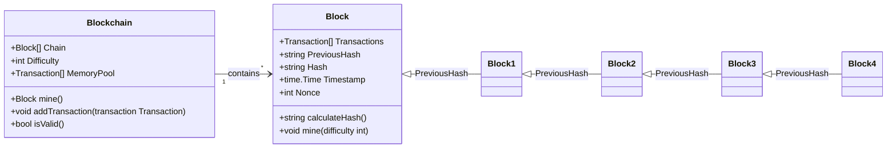
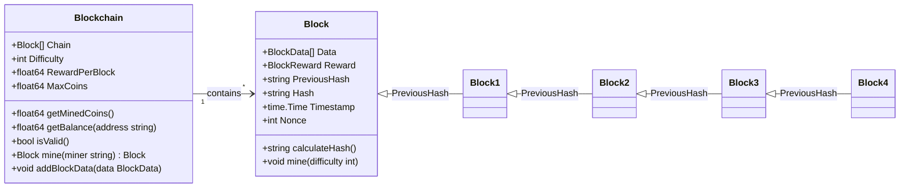

# Blockchain
The best way to learn blockchain is by building one. This repository guides you from creating a basic blockchain to understanding advanced concepts, providing hands-on experience along the way. Dive in and start your blockchain journey today!

## [Simple Blockchain](./0-simple-blockchain/README.md)
```
docker run -p 7000:7000 propilideno/simple-blockchain
```


#### Routes
- GET /chain
- GET /memorypool
- GET /mine
- POST /transactions/new
    - body: `{ "from": "Lucas", "to": "Filipe", "amount": 10 }`
#### Lacks of
- Transaction validation
- Persistence
- Miner Reward
- Descentralization
    - P2P Network
    - Node discovery

## [Simple Transactional Blockchain](./1-simple-transactional-blockchain/README.md)
```
docker run -p 7000:7000 propilideno/simple-transactional-blockchain
```

#### Routes
- GET /chain
- GET /memorypool
- GET /mine?wallet=**base64_encoded_public_key**
- POST /data/new
    - body: `{ "from": "Lucas", "to": "Filipe", "amount": 10 }`

#### Lacks of
- Persistence
- Descentralization
    - P2P Network
    - Node discovery
